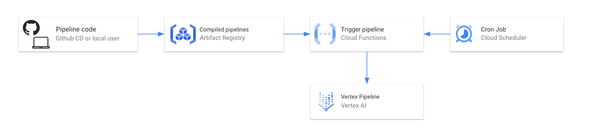
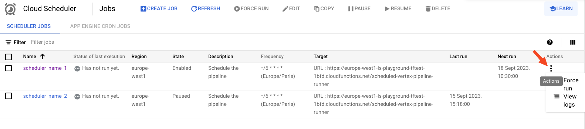

# Vertex Pipelines Scheduler Accelerator

This repository enables to easily schedule existing Vertex pipelines.

It uploads Vertex pipelines templates to an Artifact Registry repository and schedules pipelines using Cloud Scheduler and Cloud Functions.



It does for you the creation of the required service accounts, configures the required permissions and creates the necessary cloud resources.

## Table of Contents

- [Vertex Pipelines Scheduler Accelerator](#vertex-pipelines-scheduler-accelerator)
  - [Table of Contents](#table-of-contents)
  - [Prerequisites](#prerequisites)
  - [Setup](#setup)
  - [Installation](#installation)
  - [Usage](#usage)
  - [Sanity check](#sanity-check)
  - [More details](#more-details)

## Prerequisites

- Unix-like environment (Linux, macOS, WSL, etc... Tested on MacOS Monterey, M1 chip)
- Google SDK (gcloud) (instructions [here](https://cloud.google.com/sdk/docs/install#installation_instructions))
- Terraform (tested for version v1.5.6 on darwin_arm64) (instructions [here](https://developer.hashicorp.com/terraform/tutorials/aws-get-started/install-cli#install-terraform))
- Having `wget` installed (instructions [here](https://www.gnu.org/software/wget/) for Linux and for MacOS: `brew install wget`)
- Having a compiled Vertex pipeline (instructions [here](https://cloud.google.com/vertex-ai/docs/pipelines/build-pipeline#compile_your_pipeline_into_a_yaml_file))

> Note: if you don't have a compiled pipeline or have trouble compiling it, you can use the [`hello_world_pipeline.yaml`](examples/hello_world_pipeline.yaml) file to test the scheduling.

## Setup

First, you need to setup authentication to Google Cloud (select the relevant Google account and project):

```bash
gcloud config set project <gcp_project_id>
gcloud auth login
gcloud auth application-default login
```

## Installation

If not done already, download this repository on your local machine:

```bash
wget -O scheduled-pipelines.zip https://github.com/artefactory/scheduled-pipelines/archive/main.zip
```

Then unzip it:

```bash
unzip scheduled-pipelines.zip \
&& rm scheduled-pipelines.zip \
&& mv scheduled-pipelines-main scheduled-pipelines \
&& cd scheduled-pipelines
```

## Usage

To use this repository, you need to:

1. Initialize your own scheduled pipelines config file:

```bash
cp config/scheduled_pipelines_config_example.yaml config/scheduled_pipelines_config.yaml \
&& rm config/scheduled_pipelines_config_example.yaml
```

2. **Replace the values** in the created configuration file  [`config/scheduled_pipelines_config.yaml`](config/scheduled_pipelines_config.yaml) with the values **corresponding to your project**.

3. Enable the required APIs:

```bash
gcloud services enable \
    cloudscheduler.googleapis.com \
    cloudfunctions.googleapis.com \
    cloudbuild.googleapis.com \
    artifactregistry.googleapis.com \
    storage-component.googleapis.com \
    aiplatform.googleapis.com \
    --project=<GCP_PROJECT_ID>
```

4. Create the required service accounts and cloud resources:

```bash
make build_resources
```

This command will:

- Create the service accounts used to run the scheduled pipelines and schedule them.
- Create the necessary cloud resources (Cloud Scheduler, Cloud Functions, Artifact Registry repository).
- Give the appropriate permissions to the service accounts.


5. Upload the YAML file to the Artifact Registry repository:

```bash
make upload_template <path_to_local_pipeline_yaml_file>
```

Run this command as many times as you want to upload different pipelines.

> Note: you can use the dummy pipeline to test the scheduling: `make upload_template examples/hello_world_pipeline.yaml`


## Sanity check

To check that everything is working as expected, you can go to the Cloud Scheduler page in the Google Cloud console and make sure the right schedulers are present.
Then, you can trigger a force run of one of the scheduler and check that the Vertex pipeline is running as expected.



> Note: you can click on "View logs" to debug the job if needed.

## More details

The required permissions required to execute the `make build_resources` command are:

| Resource creation        | Permission(s) required                                    |
| ------------------------ | --------------------------------------------------------- |
| Create service account   | iam.serviceAccounts.create                                |
| Create artifact registry | artifactregistry.repositories.create                      |
| Creation cloud function  | cloudfunctions.functions.create, cloudbuild.builds.create |
| Create cloud scheduler   | cloudscheduler.jobs.create                                |

| Resource to give permission on (iam-policy-binding) | Permission required                        |
| ----------------- | ------------------------------------------ |
| Project           | resourcemanager.projects.setIamPolicy      |
| Cloud storage     | storage.buckets.setIamPolicy               |
| Cloud function    | cloudfunctions.functions.setIamPolicy      |
| Artifact registry | artifactregistry.repositories.setIamPolicy |
