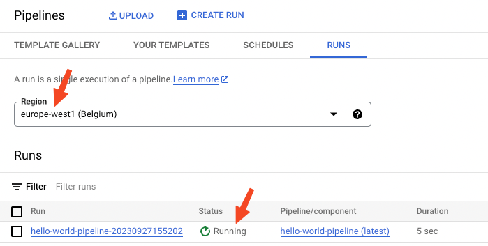

# Vertex Pipelines Scheduler Accelerator

This repository enables to easily schedule existing Vertex pipelines.

It uploads Vertex pipelines templates to an Artifact Registry repository and schedules pipelines using Cloud Scheduler and Cloud Functions.


It does for you the creation of the required service accounts, configures the required permissions and creates the necessary cloud resources.

## Table of Contents

- [Vertex Pipelines Scheduler Accelerator](#vertex-pipelines-scheduler-accelerator)
  - [Table of Contents](#table-of-contents)
  - [Prerequisites](#prerequisites)
  - [Setup](#setup)
  - [Installation](#installation)
  - [Usage](#usage)
  - [Sanity check](#sanity-check)
  - [Troubleshooting](#troubleshooting)
  - [More details](#more-details)

## Prerequisites

- Unix-like environment (Linux, macOS, WSL, etc... Tested on MacOS Monterey, M1 chip & GNU/Linux 10)
- Google SDK (gcloud) (instructions [here](https://cloud.google.com/sdk/docs/install#installation_instructions))
- Terraform (tested for version v1.5.6) (instructions [here](https://developer.hashicorp.com/terraform/tutorials/aws-get-started/install-cli#install-terraform))
- Having `wget` installed (instructions [here](https://www.gnu.org/software/wget/) for Linux and for MacOS: `brew install wget`)
- Having `jq` installed (instructions [here](https://stedolan.github.io/jq/download/) for Linux and for MacOS: `brew install jq`. Tested for version jq-1.6)
- Having `yq` installed (instructions [here](https://github.com/mikefarah/yq/#install) for Linux and for MacOS: `brew install yq`. Tested for version 4.35.2)
- Having a compiled Vertex pipeline (instructions [here](https://cloud.google.com/vertex-ai/docs/pipelines/build-pipeline#compile_your_pipeline_into_a_yaml_file)) or  use the [`hello_world_pipeline.yaml`](pipelines/hello_world_pipeline.yaml) file in the `pipelines` directory to test the scheduling rapidly.

## Setup

First, execute these Google Cloud commands:

```bash
export GCP_PROJECT_ID=<gcp_project_id>
gcloud config set project $GCP_PROJECT_ID
gcloud auth login
gcloud auth application-default login
```

## Installation

Create a working directory and download this repository:

```bash
wget -O scheduled-pipelines.zip https://github.com/artefactory/scheduled-pipelines/archive/main.zip
```

Then unzip it:

```bash
unzip scheduled-pipelines.zip \
&& rm scheduled-pipelines.zip \
&& mv scheduled-pipelines-main scheduled-pipelines \
&& cd scheduled-pipelines
```

## Usage

To use this repository, you need to:

1. In the [`pipelines`](./pipelines/) directory, put your compiled pipeline(s) (YAML file) inside or directly use the dummy pipeline "`hello_world_pipeline.yaml`" (already in the `pipelines` directory).

2. Replace the values in your configuration file  [`scheduled_pipelines_config.yaml`](scheduled_pipelines_config.yaml) with the values **corresponding to your project**.

3. Enable the required APIs:

```bash
gcloud services enable \
  cloudscheduler.googleapis.com \
  cloudfunctions.googleapis.com \
  cloudbuild.googleapis.com \
  artifactregistry.googleapis.com \
  storage-component.googleapis.com \
  aiplatform.googleapis.com \
  --project=$GCP_PROJECT_ID
```

4. Deploy the scheduled pipeline(s) and its (their) infrastructure:

```bash
make deploy_scheduled_pipelines
```

This command will:

- Create the service accounts used to run the scheduled pipelines and schedule them.
- Create the necessary cloud resources (Cloud Scheduler, Cloud Functions, Artifact Registry repository).
- Give the appropriate permissions to the service accounts.
- Upload the pipeline templates to the Artifact Registry repository.

5. (Optional) If you modify the compiled pipeline(s) and/or you modify the configuration file, just run the previous command again.

## Sanity check

Go to the [Cloud Scheduler page](https://console.cloud.google.com/cloudscheduler) in the Google Cloud console and make sure the right schedulers are present.

Trigger a force run of the scheduler:

⚠️ It might take a few minutes for the scheduler to work properly with the cloud function. If the command fails, wait a few minutes and try again. ⚠️


If the "Status of last execution" is failure, check the [troubleshooting](#troubleshooting) section below.

If the "Status of last execution" is "Success", check that the [Vertex pipeline](https://console.cloud.google.com/vertex-ai/pipelines) is running as expected (make sure you selected the right region). If it it not running, check the logs of the cloud function.



## Troubleshooting

1. Check that the "Status of last execution" of the scheduler is "Success". If this is not the case:

First check the logs of the cloud scheduler to see whether the error is coming from the scheduler (permission denied) or the cloud function (internal error).

If the error is a permission denied, check that the service account of the cloud scheduler has the right permissions on the cloud function. If the error is an internal error, check the [cloud function](https://console.cloud.google.com/functions) logs (Go to the Cloud functions page, click on the cloud function name and go to the "LOGS" tab).

2. If the "Status of last execution" is "Success" but the pipeline is not running, check the logs of the cloud function to debug.

## More details

The required permissions required to execute the `make deploy_scheduled_pipelines` command are:

| Resource creation        | Permission(s) required                                    |
| ------------------------ | --------------------------------------------------------- |
| Create service account   | iam.serviceAccounts.create                                |
| Create artifact registry | artifactregistry.repositories.create                      |
| Creation cloud function  | cloudfunctions.functions.create, cloudbuild.builds.create |
| Create cloud scheduler   | cloudscheduler.jobs.create                                |

| Resource to give permission on (iam-policy-binding) | Permission required                        |
| ----------------- | ------------------------------------------ |
| Project           | resourcemanager.projects.setIamPolicy      |
| Cloud storage     | storage.buckets.setIamPolicy               |
| Cloud function    | cloudfunctions.functions.setIamPolicy      |
| Artifact registry | artifactregistry.repositories.setIamPolicy |
